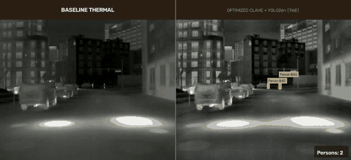
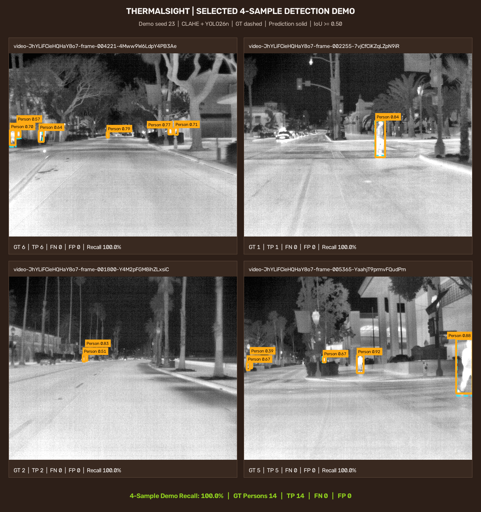
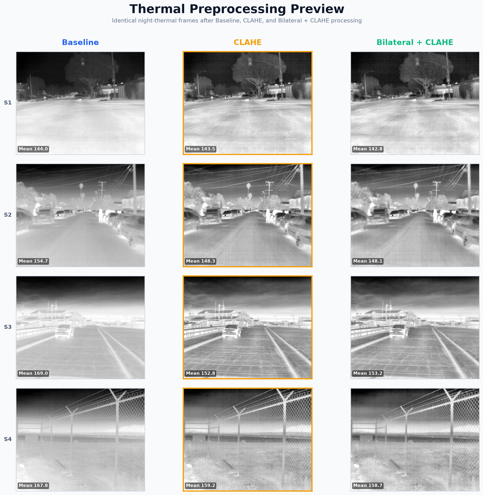
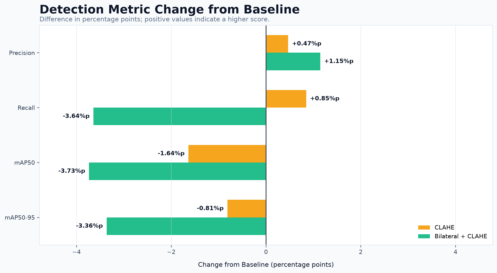
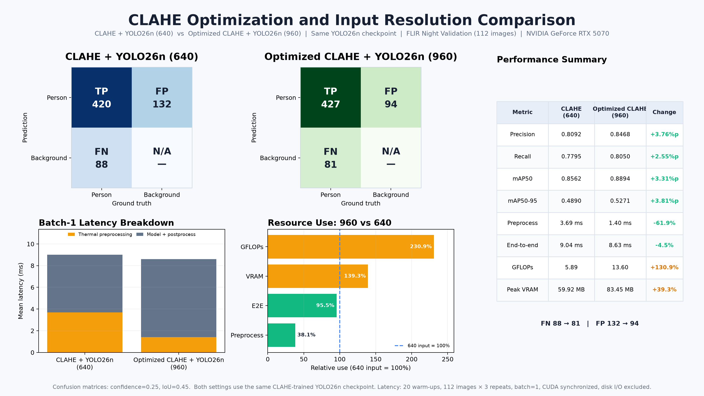
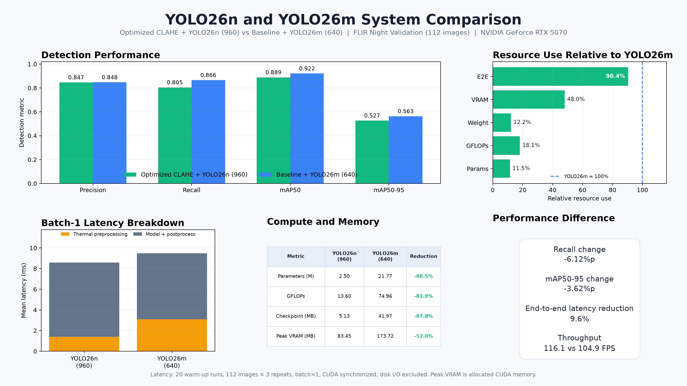

# Thermal Pedestrian Detection

> **Thermal Image Preprocessing for Lightweight Nighttime Pedestrian Detection**

야간 고비트 열영상에 영상 전처리를 적용해 경량 객체탐지 모델의 보행자 탐지 성능을 보완하고, 최종 시스템을 더 큰 YOLO26m과 정확도·연산량·지연시간·메모리 관점에서 비교한 프로젝트다.

---

## Demo

### Thermal Video Demo

동일한 열영상 프레임을 좌우로 배치했다. 왼쪽은 Baseline thermal 영상이고, 오른쪽은 Optimized CLAHE + YOLO26n (960)의 보행자 탐지 결과다.



- GIF: `720 × 328`, 143 frames, 약 42.9초
- Original MP4: `1280 × 584`, 428 frames, 10 FPS

### Validation Detection Examples

최종 모델을 FLIR Validation positive sample 4장에 적용한 결과다. 청록색 점선은 정답, 주황색 실선은 예측을 의미한다.



| GT persons | TP | FN | FP | Sample recall |
|---:|---:|---:|---:|---:|
| 14 | 14 | 0 | 2 | 100% |

> 위 수치는 선택된 4장에 대한 결과이며 전체 Validation 성능을 의미하지 않는다.

---

## Project Overview

야간 환경에서는 RGB 영상의 조도 저하로 보행자 탐지가 어려워질 수 있다. 열영상은 조명에 덜 의존하지만, 실제 센서 입력은 고비트 심도 grayscale 형태이며 원거리 보행자는 작고 배경과의 국소 대비도 낮은 경우가 많다.

본 프로젝트는 **Teledyne FLIR ADAS Thermal Dataset v2**의 야간 열영상만 사용해 `person` 객체탐지 문제를 구성했다.

첫 번째 목표는 모델 구조를 바꾸지 않고 영상 전처리만으로 경량 모델의 성능을 높일 수 있는지 확인하는 것이었다. 동일한 YOLO26n 학습 조건에서 다음 세 가지 입력을 비교했다.

1. Baseline normalization
2. CLAHE
3. Bilateral Filter + CLAHE

야간 보행자를 놓치는 False Negative를 줄이는 것을 우선해 CLAHE를 선택했다. 이후 같은 CLAHE 학습 checkpoint를 유지하면서 입력 크기를 `640 → 960`으로 높이고 전처리 구현을 최적화했다.

최종 시스템은 **Optimized CLAHE + YOLO26n (960)**이며, 비교 대상은 **Baseline + YOLO26m (640)**이다.

---

## Pipeline

```text
FLIR ADAS Thermal Dataset v2
        ↓
Night thermal image filtering
        ↓
uint16 TIFF + person label extraction
        ↓
┌────────────────────────────────────┐
│ Preprocessing experiments          │
│                                    │
│ 1. Baseline normalization          │
│ 2. CLAHE                           │
│ 3. Bilateral Filter + CLAHE        │
└────────────────────────────────────┘
        ↓
Three independent YOLO26n (640) runs
        ↓
Precision / Recall / mAP / Latency
        ↓
CLAHE selection
        ↓
Input size 640 → 960
Histogram normalization + cached CLAHE
        ↓
Baseline + YOLO26m (640) comparison
        ↓
Image and video demo
```

---

## Dataset

FLIR ADAS Thermal Dataset v2의 공식 Train / Validation split을 유지하고, metadata의 `hours == "night"` 조건에 해당하는 열영상만 사용했다.

| Item | Train | Validation |
|---|---:|---:|
| Night thermal images | 2,110 | 112 |
| Positive images | 1,851 | 92 |
| Negative images | 259 | 20 |
| Person bounding boxes | 14,032 | 508 |

총 **2,222장**의 야간 열영상과 **14,540개**의 person bounding box를 사용했다.

- Original thermal size: `640 × 512`
- Thermal TIFF dtype: `uint16`
- Detection class: `person`
- YOLO class id: `0`
- Train / Validation split: 공식 split 유지

EDA 결과 person bounding box 높이 중앙값은 Train 약 `24 px`, Validation 약 `23 px`였고, 하위 25%는 약 `15 px` 이하였다. 데이터에 원거리 소형 보행자 탐지 문제가 실제로 포함되어 있음을 확인했다.

대용량 raw·processed dataset은 저장소에 포함하지 않는다.

[FLIR ADAS Thermal Dataset v2 - Kaggle mirror](https://www.kaggle.com/datasets/samdazel/teledyne-flir-adas-thermal-dataset-v2)

---

## Thermal Preprocessing

### 1. Baseline Normalization

고비트 TIFF를 모델 입력으로 변환하기 위한 기본 정규화 단계다. Baseline은 완전한 무처리 영상이 아니다.

```text
uint16 TIFF
→ 1st / 99th percentile clipping
→ 0–255 normalization
→ uint8
```

### 2. CLAHE

Baseline normalization 이후 CLAHE를 적용해 국소 대비를 강화했다.

```text
Baseline normalization
→ CLAHE
   clipLimit = 2.0
   tileGridSize = (8, 8)
```

### 3. Bilateral Filter + CLAHE

노이즈 억제를 위해 Bilateral Filter를 먼저 적용한 뒤 CLAHE를 수행했다.

```text
Baseline normalization
→ Bilateral Filter
   d = 5
   sigmaColor = 50
   sigmaSpace = 50
→ CLAHE
```

### Preprocessing Output

동일한 네 장의 열영상에 세 전처리 조건을 적용한 결과다.



---

## Model and Training Setup

세 실험은 동일한 pretrained YOLO26n에서 각각 독립적으로 시작했다. 한 실험의 weight를 다음 실험에 이어서 사용하지 않았다.

| Hyperparameter | Value |
|---|---|
| Model | YOLO26n (`yolo26n.pt`) |
| Pretrained | True |
| Epochs | 50 |
| Image size | 640 |
| Batch size | 16 |
| Seed | 42 |
| Optimizer | Auto |
| Workers | 4 |
| Deterministic | True |
| Device | CUDA:0 |

세 실험에서 변경한 요소는 thermal preprocessing method뿐이다.

---

## Preprocessing Experiment Results

| Preprocessing | Precision | Recall | mAP50 | mAP50-95 | Preprocess latency |
|---|---:|---:|---:|---:|---:|
| Baseline | 0.8044 | 0.7691 | **0.8725** | **0.4975** | **3.265 ms** |
| CLAHE | 0.8091 | **0.7776** | 0.8561 | 0.4894 | 3.479 ms |
| Bilateral + CLAHE | **0.8159** | 0.7327 | 0.8352 | 0.4639 | 3.693 ms |



CLAHE는 Baseline보다 Recall이 `0.85%p` 높았지만 mAP50은 `1.64%p`, mAP50-95는 `0.81%p` 낮았다. 전처리 지연은 `0.214 ms` 증가했다.

모든 지표가 동시에 개선된 결과는 아니지만, False Negative 최소화를 우선하는 프로젝트 기준에서는 세 조건 중 CLAHE가 가장 적합했다. Bilateral + CLAHE는 연산 비용이 더 크면서 Recall과 mAP가 모두 감소했다.

---

## Final System Optimization

선택한 `results/clahe/best.pt`를 다시 학습하지 않고 다음 두 가지를 변경했다.

1. 추론 입력 크기를 `640`에서 `960`으로 증가
2. uint16 percentile 계산을 65,536-bin histogram 방식으로 변경하고 CLAHE 객체 재사용

즉, Optimized CLAHE (960)은 네 번째 학습 데이터셋이나 별도의 학습 모델이 아니다. 같은 CLAHE checkpoint를 사용하는 최종 추론 설정이다.



| Metric | CLAHE + YOLO26n (640) | Optimized CLAHE + YOLO26n (960) | Change |
|---|---:|---:|---:|
| Precision | 0.8092 | 0.8468 | +3.76%p |
| Recall | 0.7795 | 0.8050 | +2.55%p |
| mAP50 | 0.8562 | 0.8894 | +3.31%p |
| mAP50-95 | 0.4890 | 0.5271 | +3.81%p |
| Preprocessing latency | 3.69 ms | 1.40 ms | -61.9% |
| End-to-end latency | 9.04 ms | 8.63 ms | -4.5% |
| GFLOPs | 5.89 | 13.60 | +130.9% |
| Peak VRAM | 59.92 MB | 83.45 MB | +39.3% |

입력 크기 증가는 연산량과 VRAM 사용량을 늘렸지만 작은 보행자의 표현을 강화해 Recall과 mAP를 높였다. 전처리 최적화로 전처리 지연이 크게 감소하면서 전체 지연시간은 오히려 짧아졌다.

그림 6의 두 조건은 동일한 환경에서 다시 측정했기 때문에 최초 전처리 실험의 CLAHE 수치와 소폭 차이가 있다.

---

## Final Comparison with YOLO26m

최종 비교는 순수 모델 구조 비교가 아니라 두 배포 설정의 비교다.

- Optimized CLAHE + YOLO26n (960)
- Baseline + YOLO26m (640)



| Metric | YOLO26n system | YOLO26m system | Difference / reduction |
|---|---:|---:|---:|
| Precision | 0.8468 | 0.8478 | -0.10%p |
| Recall | 0.8050 | 0.8662 | -6.12%p |
| mAP50 | 0.8894 | 0.9217 | -3.24%p |
| mAP50-95 | 0.5271 | 0.5633 | -3.62%p |
| Parameters | 2.50 M | 21.77 M | -88.5% |
| GFLOPs | 13.60 | 74.96 | -81.9% |
| Checkpoint size | 5.13 MB | 41.97 MB | -87.8% |
| Peak VRAM | 83.45 MB | 173.72 MB | -52.0% |
| End-to-end latency | 8.61 ms | 9.53 ms | -9.6% |
| Throughput | 116.1 FPS | 104.9 FPS | +11.2 FPS |

YOLO26n 시스템은 YOLO26m보다 Recall이 `6.12%p` 낮았다. 대신 Precision은 거의 동일하게 유지하면서 parameter `88.5%`, GFLOPs `81.9%`, checkpoint 크기 `87.8%`, peak VRAM `52.0%`를 줄였다. CLAHE 전처리와 960 입력을 포함한 전체 지연시간도 약 `9.6%` 짧았다.

따라서 최종 시스템은 YOLO26m의 Recall을 완전히 대체한 결과는 아니지만, 제한된 차량용 연산 환경을 가정했을 때 정확도와 자원 사용량 사이의 분명한 운용점을 제시한다.

> 지연시간과 FPS는 실행 시점과 하드웨어 상태에 따라 달라질 수 있다. 측정 프로토콜과 원본 값은 `results/evaluation/06_clahe_optimization_640_vs_960.json`과 `results/evaluation/07_yolo26n_clahe_vs_yolo26m.json`에 저장된다.

---

## Repository Structure

```text
Thermal_Pedestrian_Detection/
├─ configs/
│  ├─ datasets/
│  ├─ requirements.txt
│  └─ training.yaml
├─ data/                         # 별도 준비
│  ├─ raw/
│  ├─ processed/
│  └─ demo/
├─ results/
│  ├─ baseline/
│  ├─ clahe/
│  ├─ bilateral_clahe/
│  ├─ yolo26m_baseline/
│  ├─ eda/
│  ├─ evaluation/
│  └─ demo/
├─ scripts/
├─ main.py                       # FLIR dataset EDA
├─ make_base_video.py            # 원본 테스트 영상 6개 변환
├─ build_processed.py            # 야간 데이터 추출 및 3종 입력 생성
├─ train.py                      # YOLO26n 전처리 실험 학습
├─ evaluate.py                   # 그림 01–05 생성
├─ optimize_clahe_960.py         # 그림 06 생성
├─ compare_yolo26m.py            # 그림 07 생성
├─ create_demo.py                # 최종 4컷 및 영상 생성
└─ README.md
```

---

## How to Run

### 1. Clone and Install

```bash
git clone https://github.com/raccoon297/Thermal_Pedestrian_Detection.git
cd Thermal_Pedestrian_Detection
pip install -r configs/requirements.txt
```

### 2. Prepare FLIR Dataset

FLIR ADAS Thermal Dataset v2를 `data/raw/FLIR_ADAS_v2/`에 배치한다. 데이터셋 자체는 저장소에 포함하지 않는다.

### 3. Dataset EDA

```bash
python main.py
```

### 4. Convert Six Baseline Videos

```bash
python make_base_video.py
```

### 5. Build Night Dataset and Preprocessed Inputs

```bash
python build_processed.py
```

야간 uint16 TIFF와 person 라벨을 추출한 뒤 Baseline, CLAHE, Bilateral + CLAHE 입력을 생성하고 검증한다.

### 6. Train Three YOLO26n Models

```bash
python train.py
```

개별 실험만 실행할 수도 있다.

```bash
python train.py --experiment baseline
python train.py --experiment clahe
python train.py --experiment bilateral_clahe
```

### 7. Generate Figures 01–05

```bash
python evaluate.py
```

그림 03–05도 `results/evaluation/`에 생성되며 README에는 핵심 그림만 표시했다.

### 8. Evaluate CLAHE Optimization and 960 Input

```bash
python optimize_clahe_960.py
```

동일한 `results/clahe/best.pt`를 이용해 기존 CLAHE (640)과 최종 설정 (960)을 다시 평가하고 그림 06을 생성한다.

### 9. Compare with YOLO26m

```bash
python compare_yolo26m.py
```

설정과 일치하는 YOLO26m checkpoint가 있으면 재사용하고, 없을 때만 학습한 뒤 그림 07을 생성한다.

### 10. Create Final Demos

```bash
python create_demo.py
```

또는 결과별로 실행할 수 있다.

```bash
python create_demo.py --mode images
python create_demo.py --mode video
```

`video` 모드는 `demo.mp4`와 README용 `demo.gif`를 함께 생성한다.

---

## Environment

| Environment | Version / Device |
|---|---|
| Python | 3.12.8 |
| Ultralytics | 8.4.116 |
| PyTorch | 2.11.0 + CUDA 13.0 |
| GPU | NVIDIA GeForce RTX 5070 12GB |

하드웨어와 라이브러리 버전에 따라 training, inference, preprocessing latency는 달라질 수 있다.

---

## Limitations

- Validation set은 112장, person bounding box는 508개로 비교적 작다.
- 640 전처리 실험에서 CLAHE는 Recall을 높였지만 mAP50과 mAP50-95는 소폭 감소했다.
- 최종 960 입력은 같은 Validation set에서 선택하고 평가했으므로 별도의 test set 검증이 필요하다.
- YOLO26n (960)과 YOLO26m (640)의 결과는 입력 크기가 다른 시스템 비교이며 순수 model-capacity 비교가 아니다.
- 개발 PC에서 측정한 latency는 실제 embedded target의 지연시간을 의미하지 않는다.
- Demo 영상은 실제 thermal camera stream 기반의 실시간 차량 환경 검증이 아니다.

---

## Future Work

- Embedded 또는 edge device에서 end-to-end latency와 FPS 측정
- 보행자 크기별 Recall 분석
- Temporal tracking을 결합한 frame 간 탐지 안정성 개선
- 별도의 thermal test set을 이용한 외부 검증
- ONNX 또는 TensorRT 변환을 통한 배포 최적화
- 실제 thermal camera stream 기반 실시간 추론

---

## References

- [Teledyne FLIR ADAS Dataset](https://www.flir.com/oem/adas/adas-dataset-form/)
- [FLIR ADAS Thermal Dataset v2 - Kaggle mirror](https://www.kaggle.com/datasets/samdazel/teledyne-flir-adas-thermal-dataset-v2)
- [Ultralytics Documentation](https://docs.ultralytics.com/)
- [OpenCV CLAHE](https://docs.opencv.org/)
