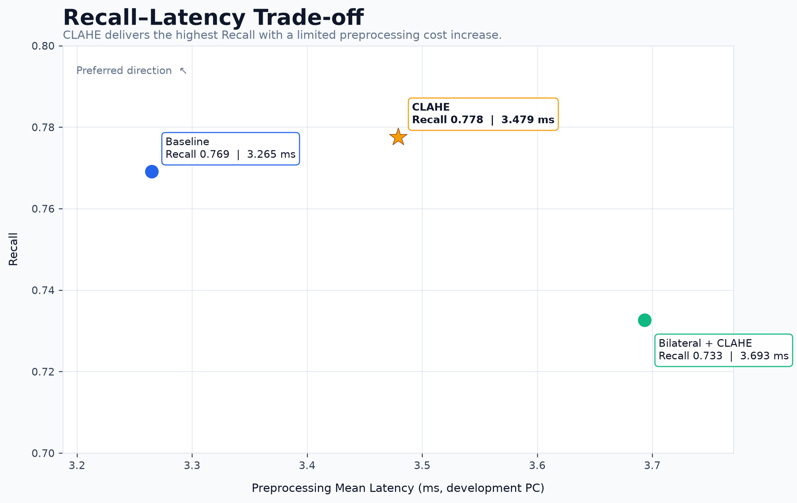
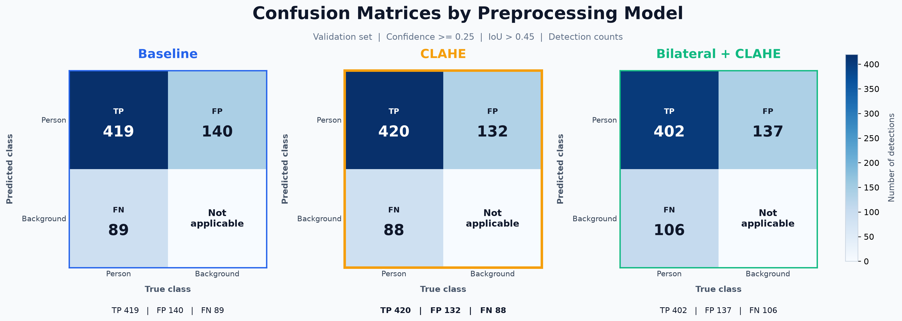

# Thermal Pedestrian Detection

> **High-Bit-Depth Thermal Image Preprocessing for Lightweight Nighttime Pedestrian Detection**

야간 고비트 열영상에서 전처리 방식이 경량 객체탐지 모델의 보행자 탐지 성능에 어떤 영향을 주는지 비교하고, **Recall–연산 비용 trade-off**를 기준으로 최종 전처리를 선택한 프로젝트다.

---

## Demo

### Validation Detection Demo

최종 모델인 **CLAHE + YOLO26n**을 Validation positive sample 4장에 적용한 결과다.


```text
GT Persons : 14
TP         : 14
FN         : 0
FP         : 0
Demo Recall: 100%
```

> 위 수치는 **선택된 4장에 대한 Demo Recall**이며 전체 Validation 성능을 의미하지 않는다.

### Thermal Video Demo

동일한 thermal frame을 기준으로 왼쪽에는 **Baseline thermal**, 오른쪽에는 **CLAHE + YOLO26n Person Detection** 결과를 배치했다.

```text
LEFT                         RIGHT
Baseline Thermal             Same frame
                              ↓
                            CLAHE
                              ↓
                            YOLO26n
                              ↓
                         Person Detection
```

**[▶ View Demo Video](results/demo/demo.mp4)**

- Resolution: `1280 × 584`
- Frames: `428`
- FPS: `10`

> Video Demo는 모델 동작을 보여주기 위한 정성적 결과다. Baseline MP4 압축/복원 과정이 포함되므로 정량 성능 평가에는 사용하지 않는다.

---

## Project Overview

야간 환경에서는 RGB 영상의 조도 저하로 인해 보행자 탐지가 어려워질 수 있다. Thermal image는 조명에 덜 의존한다는 장점이 있지만, 실제 입력은 **high-bit-depth grayscale** 형태이며 원거리 보행자는 매우 작고 배경과의 국소 대비가 충분하지 않은 경우가 있다.

본 프로젝트에서는 **Teledyne FLIR ADAS Thermal Dataset v2**의 야간 열영상만 사용해 `person` 객체탐지 문제를 구성하였다.

객체탐지 모델은 **YOLO26n**으로 고정하고, thermal preprocessing만 변경하여 다음 세 가지 조건을 비교하였다.

1. Baseline normalization
2. CLAHE
3. Bilateral Filter + CLAHE

핵심 질문은 다음과 같다.

> **제한된 연산 자원을 가정한 경량 객체탐지 모델에서, 열영상 전처리가 야간 보행자 탐지 성능을 얼마나 보완할 수 있는가?**

최종적으로 CLAHE는 Baseline 대비 mAP는 소폭 감소했지만 **Validation Recall을 0.85%p 높였고**, 추가 전처리 비용은 개발 PC 기준 약 **0.214 ms**였다.

야간 보행자 탐지에서 **False Negative 최소화**를 우선한다는 기준에 따라 **CLAHE + YOLO26n**을 최종 파이프라인으로 선택하였다.

---

## Pipeline

```text
FLIR ADAS Thermal Dataset v2
        ↓
Night thermal image filtering
        ↓
High-bit-depth TIFF (640 × 512)
        ↓
Person label conversion (COCO → YOLO)
        ↓
┌────────────────────────────────────┐
│ Thermal preprocessing experiments  │
│                                    │
│ 1. Baseline normalization          │
│ 2. CLAHE                           │
│ 3. Bilateral Filter + CLAHE        │
└────────────────────────────────────┘
        ↓
YOLO26n
        ↓
Precision / Recall / mAP / Latency
        ↓
Recall-priority model selection
        ↓
CLAHE + YOLO26n
        ↓
Image / Video Detection Demo
```

---

## Dataset

본 프로젝트에서는 FLIR ADAS Thermal Dataset v2의 공식 Train / Validation split을 유지하고, metadata의 `hours == "night"` 조건에 해당하는 thermal image만 사용하였다.

| 항목 | Train | Validation |
|---|---:|---:|
| Night thermal images | 2,110 | 112 |
| Positive images | 1,851 | 92 |
| Negative images | 259 | 20 |
| Person bounding boxes | 14,032 | 508 |

총 **2,222장**의 야간 열영상과 **14,540개**의 person bounding box를 사용하였다.

- Input resolution: `640 × 512`
- Thermal TIFF dtype: `uint16`
- Detection class: `person`
- YOLO class id: `0`
- Train / Validation split: 공식 split 유지

대용량 raw / processed dataset은 저장소에 포함하지 않는다.

Dataset mirror:  
[Teledyne FLIR ADAS Thermal Dataset v2 - Kaggle](https://www.kaggle.com/datasets/samdazel/teledyne-flir-adas-thermal-dataset-v2)

### Dataset Characteristics

EDA 결과 person bounding box 높이 중앙값은 Train 약 `24 px`, Validation 약 `23 px`였으며, 하위 25%는 약 `15 px` 이하였다.

즉 본 데이터에는 **원거리의 작은 보행자 탐지 문제**가 실제로 포함되어 있다.

---

## Thermal Preprocessing

### 1. Baseline Normalization

High-bit-depth TIFF를 객체탐지 모델 입력으로 사용하기 위해 percentile 기반 normalization을 적용하였다.

```text
uint16 TIFF
→ float32
→ 1st / 99th percentile clipping
→ 0–255 normalization
→ uint8
```

Baseline은 무처리 영상이 아니라 **모델 입력 형식을 만들기 위한 기본 thermal normalization** 단계다.

### 2. CLAHE

Baseline normalization 이후 CLAHE를 적용하여 국소 대비를 강화했다.

```text
Baseline normalization
→ CLAHE
   clipLimit = 2.0
   tileGridSize = (8, 8)
```

### 3. Bilateral Filter + CLAHE

```text
Baseline normalization
→ Bilateral Filter
   d = 5
   sigmaColor = 50
   sigmaSpace = 50
→ CLAHE
```

### Preprocessing Comparison


CLAHE는 단순히 영상을 밝게 만드는 것이 아니라 **국소 대비를 강화하여 객체와 배경의 구조적 차이를 강조**하는 역할을 한다.

---

## Model & Training Setup

모든 실험은 동일한 pretrained YOLO26n에서 **독립적으로 초기화**했다. 한 실험의 weight를 다음 실험에 이어서 학습하지 않았다.

| Hyperparameter | Value |
|---|---|
| Model | YOLO26n (`yolo26n.pt`) |
| Pretrained | True |
| Epochs | 50 |
| Image size | 640 |
| Batch size | 16 |
| Seed | 42 |
| Optimizer | Auto |
| Workers | 4 |
| Deterministic | True |
| Device | CUDA:0 |

실험 간 변경 요소는 **thermal preprocessing method**뿐이다.

---

## Results

| Preprocessing | Precision | Recall | mAP50 | mAP50-95 | Preprocess latency |
|---|---:|---:|---:|---:|---:|
| Baseline | 0.8044 | 0.7691 | **0.8725** | **0.4975** | **3.265 ms** |
| CLAHE | 0.8091 | **0.7776** | 0.8561 | 0.4894 | 3.479 ms |
| Bilateral + CLAHE | **0.8159** | 0.7327 | 0.8352 | 0.4639 | 3.693 ms |

### CLAHE vs Baseline

```text
Precision   +0.47%p
Recall      +0.85%p
mAP50       -1.64%p
mAP50-95    -0.81%p
Latency     +0.214 ms
```


CLAHE가 모든 지표를 개선한 것은 아닙니다.

**AP를 소폭 희생하는 대신 Recall을 높이는 방향으로 detection trade-off가 변화했다.**

---

## Final Model Selection

최종 전처리는 **CLAHE**를 선택하였다.

본 프로젝트에서 가장 중요하게 본 오류는 야간 보행자를 놓치는 **False Negative**이다. 따라서 최고 mAP만을 기준으로 선택하지 않고 **Recall과 전처리 비용을 함께 고려**했다.



Baseline은 가장 빠르고 mAP가 가장 높았지만, CLAHE는 약 `0.214 ms`의 추가 전처리 비용으로 본 Validation set에서 Recall을 `0.85%p` 높였다.

반면 Bilateral + CLAHE는 연산 비용이 더 증가하면서 Recall과 mAP가 모두 감소했다.

최종 inference pipeline은 다음과 같다.

```text
High-bit-depth thermal image
        ↓
Percentile normalization
        ↓
CLAHE
        ↓
YOLO26n
        ↓
Person detection
```

Final weight:

```text
results/clahe/best.pt
```

> Preprocessing latency는 현재 개발 PC에서 전처리 함수만 측정한 상대 비교값이며 embedded device의 실제 latency를 의미하지 않는다.

---

## Confusion Matrix

동일한 confidence threshold에서 각 전처리 모델의 detection 특성을 추가로 비교하였다.



고정 threshold에서 CLAHE는 Baseline 대비 False Positive와 False Negative가 모두 소폭 감소했다.

다만 Validation set의 규모가 작기 때문에 이 차이를 통계적인 우월성으로 해석하지 않다.

---

## Repository Structure

```text
Thermal_Pedestrian_Detection/
├─ configs/
│  ├─ datasets/
│  │  ├─ baseline.yaml
│  │  ├─ clahe.yaml
│  │  └─ bilateral_clahe.yaml
│  ├─ requirements.txt
│  └─ training.yaml
│
├─ data/                         # Dataset 별도 준비
│  ├─ raw/
│  ├─ processed/
│  └─ demo/
│     └─ test.mp4
│
├─ scripts/
│  ├─ data/
│  ├─ demo/
│  ├─ eda/
│  ├─ evaluation/
│  ├─ model/
│  └─ preprocessing/
│
├─ results/
│  ├─ baseline/
│  ├─ clahe/
│  ├─ bilateral_clahe/
│  ├─ demo/
│  ├─ eda/
│  ├─ evaluation/
│  └─ preprocessing/
│
├─ reports/
│
├─ main.py
├─ build_processed.py
├─ prepare_model_inputs.py
├─ train.py
├─ evaluate.py
├─ test.py
└─ README.md
```

---

## How to Run

### 1. Clone

```bash
git clone https://github.com/raccoon297/Thermal_Pedestrian_Detection.git
cd Thermal_Pedestrian_Detection
```

### 2. Install Dependencies

```bash
pip install -r configs/requirements.txt
```

### 3. Prepare Dataset

FLIR ADAS Thermal Dataset v2를 준비한 뒤 프로젝트의 raw data 경로에 배치한다.

데이터셋 자체는 repository에 포함하지 않는다.

### 4. EDA

```bash
python main.py
```

### 5. Build Night Thermal Dataset

```bash
python build_processed.py
```

### 6. Build Preprocessed Model Inputs

```bash
python prepare_model_inputs.py
```

### 7. Train

```bash
python train.py --experiment baseline
python train.py --experiment clahe
python train.py --experiment bilateral_clahe
```

또는 세 실험을 순서대로 실행:

```bash
python train.py
```

### 8. Generate Evaluation Figures

```bash
python evaluate.py
```

### 9. Run Demo

Validation image demo:

```bash
python test.py --mode images
```

Video demo:

```bash
python test.py --mode video
```

Both:

```bash
python test.py --mode all
```

---

## Environment

| Environment | Version / Device |
|---|---|
| Python | 3.12.8 |
| Ultralytics | 8.4.116 |
| PyTorch | 2.11.0 + CUDA 13.0 |
| GPU | NVIDIA GeForce RTX 5070 12GB |

하드웨어와 라이브러리 버전에 따라 training / inference / preprocessing latency는 달라질 수 있다.

---

## Limitations

- CLAHE는 Baseline보다 Recall은 높았지만 mAP50과 mAP50-95는 소폭 감소했다.
- Validation은 112장, person bounding box 508개로 비교적 작기 때문에 `0.85%p`의 Recall 차이를 일반적인 우월성으로 해석할 수 없다.
- 원거리 보행자는 bbox 크기가 매우 작아 여전히 어려운 detection 대상이다.
- Preprocessing latency는 개발 PC에서 측정한 상대 비교값이며 embedded target latency를 의미하지 않는다.
- Video Demo는 실제 thermal camera stream 기반 real-time embedded 검증이 아니라 정성적 demonstration이다.

---

## Future Work

- Embedded / edge device에서 end-to-end latency 및 FPS 측정
- 보행자 크기별 Recall 분석
- Temporal tracking을 결합한 frame 간 detection 안정성 개선
- 추가 thermal scene을 이용한 외부 test set 검증
- ONNX / TensorRT 변환을 통한 deployment 최적화
- 실제 thermal camera stream 기반 real-time inference 구현

---

## References

- [Teledyne FLIR ADAS Dataset](https://www.flir.com/oem/adas/adas-dataset-form/)
- [FLIR ADAS Thermal Dataset v2 - Kaggle mirror](https://www.kaggle.com/datasets/samdazel/teledyne-flir-adas-thermal-dataset-v2)
- [Ultralytics Documentation](https://docs.ultralytics.com/)
- [OpenCV CLAHE](https://docs.opencv.org/)
